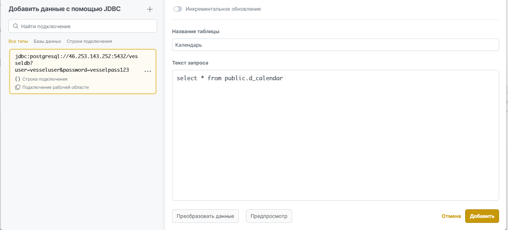
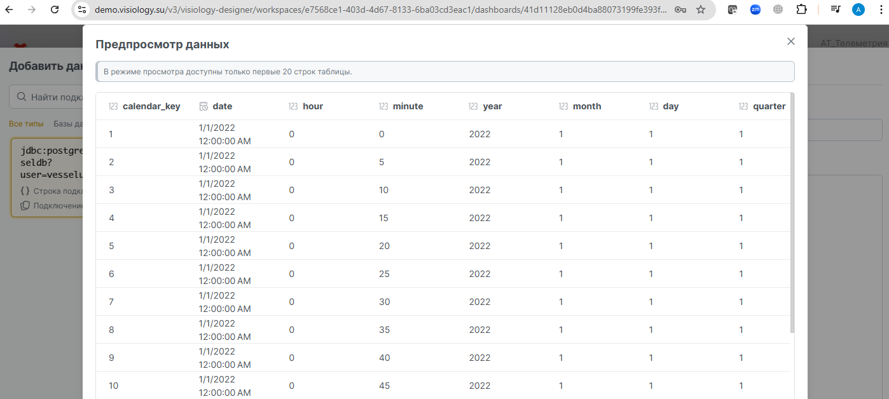
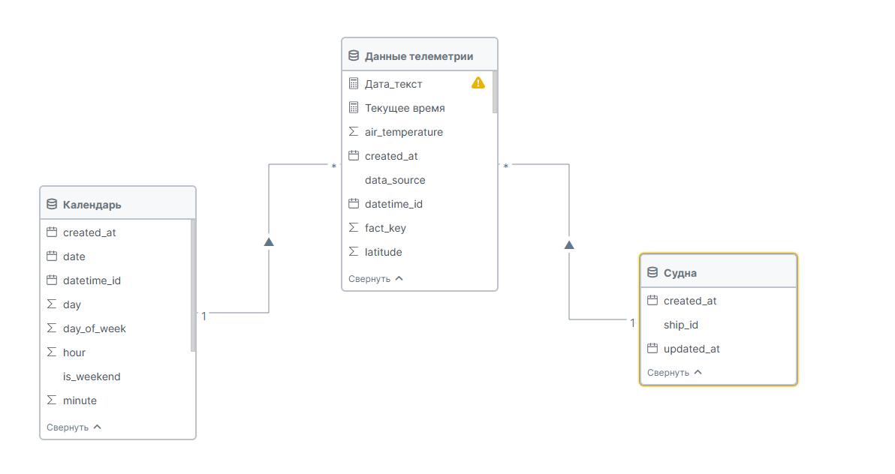
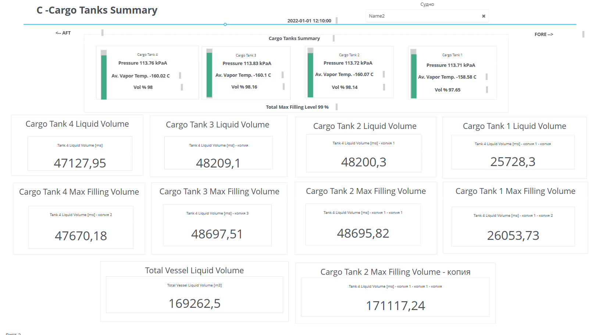
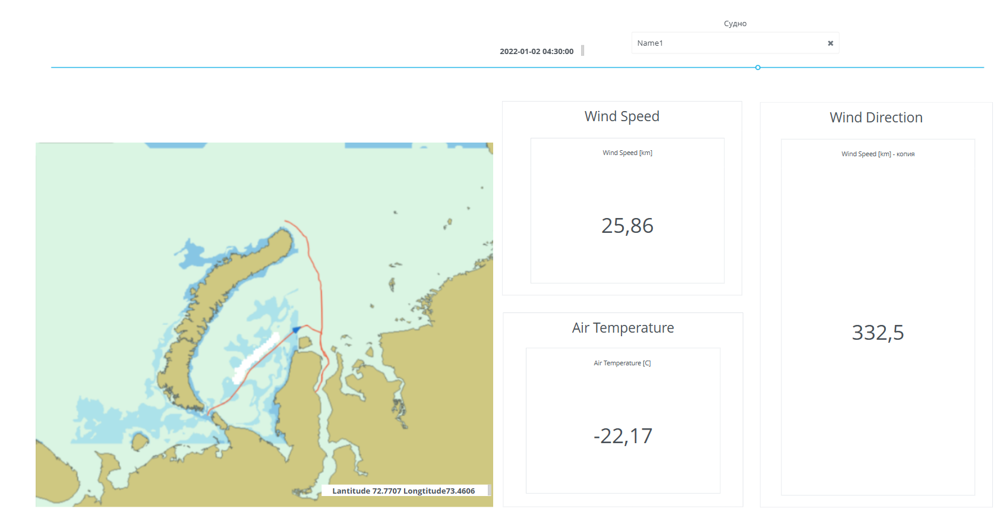
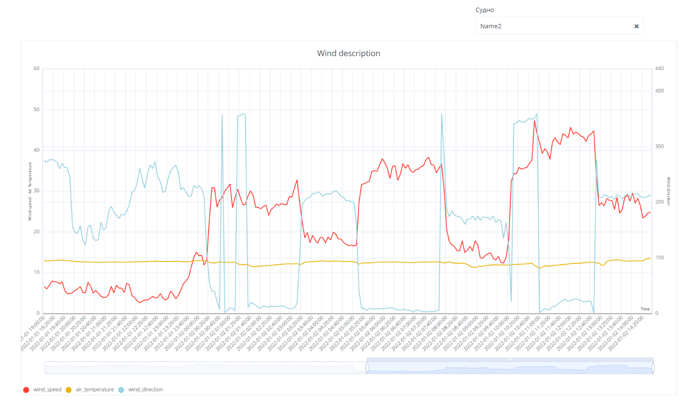

Код загрузки данных писался с использование ИИ, класс движка 4.5
в режиме: ИИ - ведущий разрабочик

Развернута базы на собственном сервер в докер (конфиги в проекте)

jdbc:postgresql://46.253.143.252:5432/vesseldb?user=vesseluser&password=vesselpass123
Файл развертывания базы данных 
[docker-compose.yml](docker-compose.yml)

Скрипт создания базы данных
[create_postgresql_schema.sql](create_postgresql_schema.sql)

ETL - можно поставить на Cron
[etl_ship_data_with_schema.py](etl_ship_data_with_schema.py)

Данных в единицу времени немного, обновляются не быстро, принебрег стейджем, но перевел сам Excel на порционную загрузку с проверкой файлов, преобразованием, валидация данных и без дублирование загрузки

Система Visiology глючная, несколько раз терял часть несохранненного дела,
при добавлнии фонового черного цвета - ошибки сохранения

VISIOLOGY JSON:

[AТ_Основной.json](AТ_Основной.json)

Скриншоты BI: 

Ролики работы:

[video 1](video/bandicam 2025-11-04 22-54-27-969.mp4)

[video 2](video/bandicam 2025-11-04 23-08-17-166.mp4)

[video 3](video/bandicam 2025-11-04 23-10-37-028.mp4)

Ссылки на деши:

https://demo.visiology.su/v3/visiology-designer/workspaces/e7568ce1-403d-4d67-8133-6ba03cd3eac1/dashboards/41d11128eb0d4ba88073199fe393fb9a

Закладка 1:
https://demo.visiology.su/v3/dashboard-viewer?workspaceId=e7568ce1-403d-4d67-8133-6ba03cd3eac1&dashboardGuid=41d11128eb0d4ba88073199fe393fb9a&showNav=true

Закладка 2:
https://demo.visiology.su/v3/dashboard-viewer?workspaceId=e7568ce1-403d-4d67-8133-6ba03cd3eac1&dashboardGuid=41d11128eb0d4ba88073199fe393fb9a&sheetGuid=fc3ac8a4a6c94dbfa4a5509e6f4685a4

Закладка 3:
https://demo.visiology.su/v3/dashboard-viewer?workspaceId=e7568ce1-403d-4d67-8133-6ba03cd3eac1&dashboardGuid=41d11128eb0d4ba88073199fe393fb9a&sheetGuid=15ee86d290724695be9aae25f01d69d6